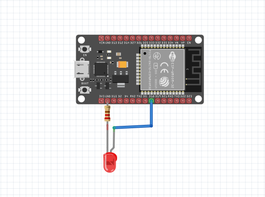

# ESP32 MQTT LED 

Projeto que utiliza um **ESP32** para controlar um **LED** via **MQTT**. O dispositivo se conecta a um broker MQTT e responde a comandos para ligar e desligar o LED.

## Montagem do circuito

## 🔧 Tecnologias utilizadas
- ESP32
- MQTT (Mosquitto)
- Arduino C/C++
- Aplicativo: IoT MQTT Panel

## 🚀 Funcionalidades
- Conexão do ESP32 a um broker MQTT
- Subscrição em um tópico específico para receber comandos
- Controle remoto do LED via mensagens MQTT

## 📌 Objetivo
Este projeto é uma implementação simples de IoT, ideal para testes e aprendizado sobre comunicação via MQTT.

## 📜 Licença
Este projeto é licenciado sob a licença MIT - veja o arquivo [LICENSE](LICENSE) para mais detalhes.
